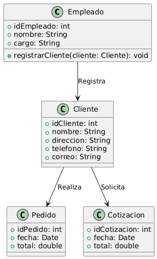

# GESTIÓN DE VENTAS

------

## Caso de uso historia 
Juan, empleado del área de ventas, registra a un nuevo cliente, Pedro Martínez, al no encontrarlo en el sistema. Completa un formulario con sus datos básicos (nombre, contacto y dirección) y guarda el registro. El sistema valida la información y confirma su creación, permitiendo gestionar cotizaciones y pedidos de inmediato.

---

<table id="customers">
  <tr class="idtext principal">
    <td>ID SYN-1</td>
  </tr>
  <tr class="single text">
    <td><strong>Requerimiento</strong>: Registrar nuevos clientes ID SYN-1</td>
  </tr>
  <tr class="single gray">
    <td><strong>Historia de usuario</strong></td>
  </tr>
  <tr class="single text">
    <td>Como empleado del área de ventas quiero registrar nuevos clientes con su información básica para contar con un registro completo y actualizado de los clientes, lo que me permitirá gestionar sus cotizaciones, pedidos y otros servicios de manera eficiente.</td>
  </tr>
  <tr class="duo">
    <th class="gray"><strong>Estado de la tarea</strong></th>
    <th>En desarrollo</th>
  </tr>
  <tr class="single gray">
    <td><strong>Caso de uso (Pasos)</strong></td>
  </tr>
  <tr class="single text">
    <td>
        <ol>
            <li>El empleado accede al formulario de registro de clientes desde el sistema.</li>
            <li>El empleado ingresa la siguiente información básica del cliente.</li>
            <li>El sistema valida los datos.</li>
        </ol>
    </td>
  </tr>
  <tr class="single gray">
    <td><strong>Criterios de Aceptación</strong></td>
  </tr>
  <tr class="single text">
    <td>
        <ol>
            <li>El sistema debe permitir registrar clientes con los campos: Nombre completo, Dirección, Teléfono, Correo electrónico.</li>
<li>El sistema debe garantizar que los campos obligatorios no estén vacíos al intentar registrar un cliente.</li>
<li>El sistema debe validar que el teléfono y el correo electrónico tienen el formato adecuado antes de permitir guardar el registro.</li>
<li>El sistema debe permitir la modificación de la información de un cliente registrado, asegurando que los datos actualizados sean correctos.</li>
<li>El sistema debe permitir eliminar un cliente de la base de datos, y el sistema debe solicitar confirmación antes de proceder con la eliminación.</li>
<li>Después de registrar un cliente, el sistema debe mostrar un mensaje de éxito y redirigir al empleado a la pantalla principal o lista de clientes.</li>
<li>Si el registro es incorrecto (por ejemplo, si un campo obligatorio está vacío o el teléfono no es válido), el sistema debe mostrar un mensaje de error claro y no permitir el registro del cliente hasta que los errores sean corregidos.</li>

        </ol>
    </td>
  </tr>
 <tr class="duo">
    <th class="gray"><strong>Calidad</strong></th>
    <th>En desarrollo</th>
  </tr>
  <tr class="duo">
    <th class="gray"><strong>Versionamiento</strong></th>
    <th>En desarrollo</th>
  </tr>
</table>

---
## Diagrama de Clases
[Creado con plantuml](https://plantuml.com/es/)

 

---