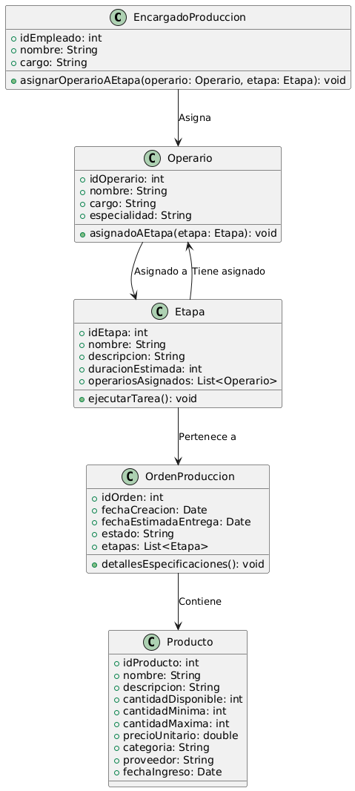

# GESTIÓN DE PRODUCCIÓN

------

## Caso de uso historia 
Carlos, encargado de producción, organiza el flujo de trabajo para una nueva orden de producción. Accede al sistema y asigna operarios a las distintas etapas del proceso productivo, asegurándose de que cada tarea sea ejecutada por el personal con las habilidades adecuadas.El sistema actualiza el estado de cada etapa y permite a los operarios ver sus asignaciones, lo que optimiza la organización y eficiencia en la producción.

---

<table id="customers">
  <tr class="idtext principal">
    <td>ID SYN-20</td>
  </tr>
  <tr class="single text">
    <td><strong>Requerimiento</strong>:Asignar operarios a etapas de producción. ID SYN-20</td>
  </tr>
  <tr class="single gray">
    <td><strong>Historia de usuario</strong></td>
  </tr>
  <tr class="single text">
    <td>Como encargado de producción quiero asignar operarios a etapas específicas del proceso de producción para garantizar que cada tarea sea ejecutada por el personal adecuado y mejorar la organización del flujo productivo.
</td>
  </tr>
  <tr class="duo">
    <th class="gray"><strong>Estado de la tarea</strong></th>
    <th>En desarrollo</th>
  </tr>
  <tr class="single gray">
    <td><strong>Caso de uso (Pasos)</strong></td>
  </tr>
  <tr class="single text">
    <td>
        <ol>
            <li>
             <li>El encargado de producción accede al módulo "Gestión de Producción" y selecciona una orden de producción activa.</li>
            <li>Dentro de la orden, el encargado selecciona una etapa específica del proceso de producción (ej., corte, ensamblaje, pintura).</li>
            <li>El sistema muestra una lista de operarios disponibles junto con su estado actual (disponible/ocupado), habilidades y experiencia.</li>
            <li>El encargado selecciona uno o más operarios para la etapa y confirma la asignación.</li>
            <li>El sistema actualiza la orden de producción para incluir la asignación de operarios y notifica al operario asignado sobre su nueva tarea.</li>
            <li>El encargado puede visualizar la asignación en el resumen de la orden de producción.</li>
        </ol>
    </td>
  </tr>
  <tr class="single gray">
    <td><strong>Criterios de aceptación</strong></td>
  </tr>
  <tr class="single text">
    <td>
        <ol>
              <li>El sistema debe permitir al encargado de producción seleccionar una etapa específica dentro de una orden de producción.</li>
              <li>Solo operarios disponibles deben ser visibles en la lista para asignación.</li>
              <li>El sistema debe mostrar información relevante sobre los operarios, como habilidades y experiencia, para facilitar la selección.</li>
              <li>Una vez realizada la asignación, el operario debe ser notificado automáticamente.</li>
              <li>El encargado debe poder modificar la asignación en caso de errores o cambios en la planificación.</li>
            </ol>
 <tr class="duo">
    <th class="gray"><strong>Calidad</strong></th>
    <th>En desarrollo</th>
  </tr>
  <tr class="duo">
    <th class="gray"><strong>Versionamiento</strong></th>
    <th>En desarrollo</th>
  </tr>
</table>

---
## Diagrama de Clases
[Creado con plantuml](https://plantuml.com/es/)

---