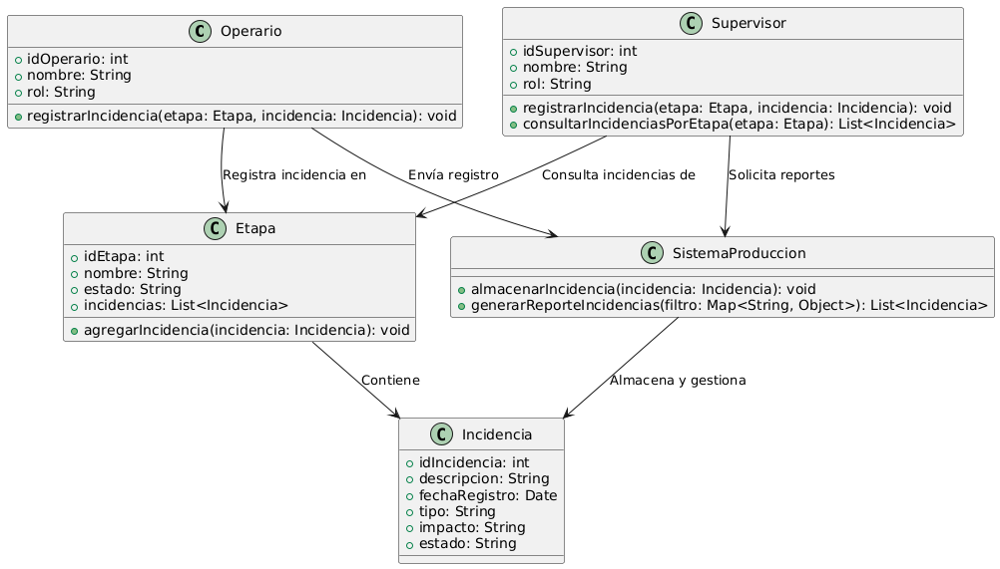

# GESTIÓN DE PRODUCCIÓN

------

## Caso de uso historia 
Luis, supervisor de producción, detecta un problema en una etapa del proceso que podría retrasar la fabricación. Accede al sistema, registra la incidencia con detalles del problema y su impacto potencial en los plazos y la calidad. El sistema guarda la información y envía una alerta al equipo correspondiente para tomar acciones correctivas. Esto permite documentar el problema, analizar sus causas y aplicar soluciones rápidamente, minimizando los efectos negativos en la producción.

---

<table id="customers">
  <tr class="idtext principal">
    <td>ID SYN-26</td>
  </tr>
  <tr class="single text">
    <td><strong>Requerimiento</strong>:Registrar incidencias durante la producción. ID SYN-26</td>
  </tr>
  <tr class="single gray">
    <td><strong>Historia de usuario</strong></td>
  </tr>
  <tr class="single text">
    <td>Como operario o supervisor de producción quiero registrar incidencias durante el proceso de producción para documentar problemas, analizarlos y tomar acciones correctivas que minimicen impactos en los plazos y calidad del producto.
</td>
  </tr>
  <tr class="duo">
    <th class="gray"><strong>Estado de la tarea</strong></th>
    <th>En desarrollo</th>
  </tr>
  <tr class="single gray">
    <td><strong>Caso de uso (Pasos)</strong></td>
  </tr>
  <tr class="single text">
    <td>
        <ol>
            <li>
             <li>El usuario accede al módulo "Registro de Incidencias".</li>
            <li>Selecciona la orden de producción y la etapa específica donde ocurrió la incidencia.</li>
            <li>Ingresa los detalles de la incidencia, que incluyen:Tipo de incidencia, Descripción del problema, Fecha y hora. Recursos afectados (si aplica).</li>
            <li>Adjunta evidencia opcional, como fotografías o documentos.</li>
            <li>Revisa y confirma el registro.</li>
            <li>El sistema guarda la incidencia y envía notificaciones automáticas al encargado de producción para su análisis.</li>
        </ol>
    </td>
  </tr>
  <tr class="single gray">
    <td><strong>Criterios de aceptación</strong></td>
  </tr>
  <tr class="single text">
    <td>
        <ol>
              <li>El sistema debe permitir registrar incidencias asociadas a órdenes en proceso.</li>
              <li>Los campos obligatorios incluyen: tipo de incidencia, descripción, fecha y hora.</li>
              <li>Los usuarios deben poder adjuntar archivos relacionados, como fotos o reportes.</li>
              <li>El sistema debe generar un identificador único para cada incidencia registrada.</li>
              <li>El sistema debe notificar automáticamente al encargado de producción y otros responsables designados</li>
            </ol>
 <tr class="duo">
    <th class="gray"><strong>Calidad</strong></th>
    <th>En desarrollo</th>
  </tr>
  <tr class="duo">
    <th class="gray"><strong>Versionamiento</strong></th>
    <th>En desarrollo</th>
  </tr>
</table>

---
## Diagrama de Clases
[Creado con plantuml](https://plantuml.com/es/)

 

---