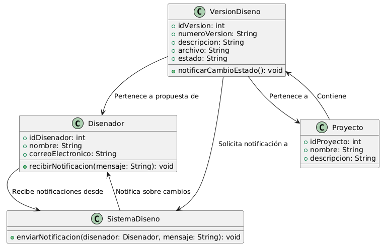

# GESTIÓN DE DISEÑO

------

## Caso de uso historia 
Laura, diseñadora, espera la aprobación de una nueva versión de diseño que presentó. Más tarde, recibe una notificación del sistema informándole que el diseño ha sido aprobado, permitiéndole continuar con el siguiente paso del proyecto.En otro caso, Laura recibe una notificación indicando que su diseño fue rechazado, junto con comentarios del supervisor. Gracias a esta información, puede realizar los ajustes necesarios y volver a enviarlo para aprobación.

---

<table id="customers">
  <tr class="idtext principal">
    <td>ID SYN-33</td>
  </tr>
  <tr class="single text">
    <td><strong>Requerimiento</strong>:Notificar cuando se apruebe o rechace un diseño. ID SYN-33</td>
  </tr>
  <tr class="single gray">
    <td><strong>Historia de usuario</strong></td>
  </tr>
  <tr class="single text">
    <td>Como diseñador quiero recibir notificaciones cuando se apruebe o rechace un diseño,  para conocer el estado de mis propuestas y realizar ajustes en caso de ser necesario.
</td>
  </tr>
  <tr class="duo">
    <th class="gray"><strong>Estado de la tarea</strong></th>
    <th>En desarrollo</th>
  </tr>
  <tr class="single gray">
    <td><strong>Caso de uso (Pasos)</strong></td>
  </tr>
  <tr class="single text">
    <td>
        <ol>
            <li>El supervisor revisa un diseño y decide aprobarlo o rechazarlo.</li>
            <li>El sistema registra la decisión y genera una notificación para el diseñador.</li>
            <li>El diseñador recibe una notificación a través de: Correo electrónico, Notificación en la plataforma.</li>
            <li>La notificación incluye: Nombre del diseño, Proyecto asociado, Estado actualizado (aprobado/rechazado), Comentarios.</li>
        </ol>
    </td>
  </tr>
  <tr class="single gray">
    <td><strong>Criterios de aceptación</strong></td>
  </tr>
  <tr class="single text">
    <td>
        <ol>
            <li>El sistema debe notificar automáticamente al diseñador al aprobar o rechazar un diseño.</li>
            <li>La notificación debe incluir: Nombre del diseño, Proyecto asociado, Estado actualizado, Comentarios.</li>
            <li>Las notificaciones deben enviarse por correo electrónico y mostrarse en la plataforma del sistema.</li>
            <li>Si el envío falla, el sistema debe registrar el error y reintentar el envío.</li>
            </ol>
 <tr class="duo">
    <th class="gray"><strong>Calidad</strong></th>
    <th>En desarrollo</th>
  </tr>
  <tr class="duo">
    <th class="gray"><strong>Versionamiento</strong></th>
    <th>En desarrollo</th>
  </tr>
</table>

---
## Diagrama de Clases
[Creado con plantuml](https://plantuml.com/es/)

---