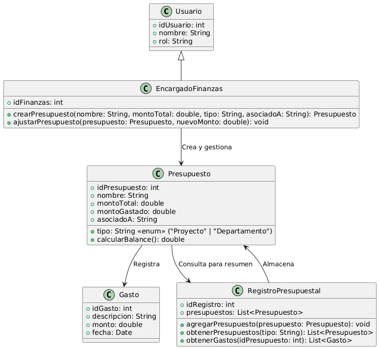

# GESTIÓN FINANCIERA

------

## Caso de uso historia 
Sofía, encargada de finanzas, recibe una solicitud para asignar un presupuesto a un nuevo proyecto. Accede al sistema financiero, selecciona la opción "Crear Presupuesto" e ingresa los detalles del proyecto, el monto asignado y las categorías de gasto. El sistema registra el presupuesto, lo vincula al proyecto correspondiente y permite el seguimiento del uso de los recursos. Esto asegura que los gastos se mantengan dentro de los límites asignados y facilita la gestión eficiente de los recursos financieros.

---

<table id="customers">
  <tr class="idtext principal">
    <td>ID SYN-39</td>
  </tr>
  <tr class="single text">
    <td><strong>Requerimiento</strong>:Crear presupuestos asociados a proyectos o departamentos. ID SYN-39</td>
  </tr>
  <tr class="single gray">
    <td><strong>Historia de usuario</strong></td>
  </tr>
  <tr class="single text">
    <td>Como encargado de finanzas quiero crear presupuestos asociados a proyectos o departamentos para gestionar de manera eficiente los recursos financieros y asegurarnos de que los proyectos y departamentos se mantengan dentro del presupuesto asignado.
</td>
  </tr>
  <tr class="duo">
    <th class="gray"><strong>Estado de la tarea</strong></th>
    <th>En desarrollo</th>
  </tr>
  <tr class="single gray">
    <td><strong>Caso de uso (Pasos)</strong></td>
  </tr>
  <tr class="single text">
    <td>
        <ol>
            <li>
             <li>El encargado de finanzas accede al módulo de presupuestos del sistema.</li>
            <li>El usuario selecciona la opción de crear un nuevo presupuesto.</li>
            <li>El usuario elige el proyecto o departamento al cual asociará el presupuesto.</li>
            <li>El usuario ingresa los detalles del presupuesto: Monto total del presupuesto, Categorías de gasto (por ejemplo, materiales, mano de obra, otros gastos), Fecha de inicio y fin del presupuesto.</li>
            <li>El encargado de finanzas confirma la creación del presupuesto.</li>
            <li>El sistema guarda el presupuesto y asocia los detalles con el proyecto o departamento seleccionado.</li>
            <li>El sistema actualiza el historial financiero y muestra el presupuesto en los reportes correspondientes.</li>
        </ol>
    </td>
  </tr>
  <tr class="single gray">
    <td><strong>Criterios de aceptación</strong></td>
  </tr>
  <tr class="single text">
    <td>
        <ol>
              <li>El sistema debe permitir al usuario crear presupuestos con los detalles necesarios (monto, categorías, fechas, etc.).</li>
              <li>El sistema debe asociar correctamente el presupuesto al proyecto o departamento seleccionado.</li>
              <li>El sistema debe validar que todos los campos requeridos (monto, fechas) estén completos antes de permitir guardar el presupuesto.</li>
              <li>El sistema debe actualizar el historial financiero con el nuevo presupuesto.</li>
              <li>El sistema debe permitir visualizar los presupuestos creados en los reportes financieros del proyecto o departamento.</li>
            </ol>
 <tr class="duo">
    <th class="gray"><strong>Calidad</strong></th>
    <th>En desarrollo</th>
  </tr>
  <tr class="duo">
    <th class="gray"><strong>Versionamiento</strong></th>
    <th>En desarrollo</th>
  </tr>
</table>

---
## Diagrama de Clases
[Creado con plantuml](https://plantuml.com/es/)

---
 
 