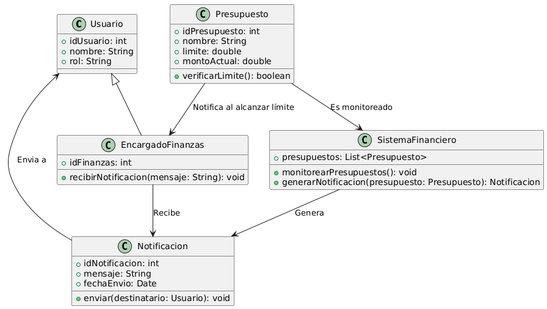

# GESTIÓN FINANCIERA 

------

## Caso de uso historia 
Sofía, encargada de finanzas, recibe una notificación automática del sistema indicando que un presupuesto asignado a un proyecto está a punto de alcanzar su límite.
Con esta alerta, Sofía revisa los gastos asociados al proyecto, identifica áreas donde puede ajustar el consumo de recursos y toma medidas para evitar desajustes financieros.

---

  <tr class="idtext principal">
    <td>ID SYN-42</td>
  </tr>
  <tr class="single text">
    <td><strong>Requerimiento</strong>:Notificar cuando un presupuesto alcance su límite. ID SYN-42</td>
  </tr>
  <tr class="single gray">
    <td><strong>Historia de usuario</strong></td>
  </tr>
  <tr class="single text">
    <td>Como encargado de finanzas quiero recibir una notificación cuando un presupuesto alcance su límite para poder tomar medidas preventivas antes de que se superen los límites establecidos y evitar desajustes financieros.
</td>
  </tr>
  <tr class="duo">
    <th class="gray"><strong>Estado de la tarea</strong></th>
    <th>En desarrollo</th>
  </tr>
  <tr class="single gray">
    <td><strong>Caso de uso (Pasos)</strong></td>
  </tr>
  <tr class="single text">
    <td>
        <ol>
            <li>
             <li>El encargado de finanzas configura un presupuesto con un valor límite en el sistema.</li>
              <li>A medida que se registran transacciones de ingresos o egresos asociadas al presupuesto, el sistema realiza un seguimiento en tiempo real del monto total utilizado.</li>
              <li>Cuando el valor total registrado se acerca o alcanza el límite del presupuesto, el sistema envía una notificación automática al encargado de finanzas.</li>
              <li>La notificación incluye detalles sobre el presupuesto, el valor utilizado hasta el momento y el valor restante o si ya ha sido superado.</li>
              <li>El encargado de finanzas recibe la notificación a través de un medio previamente configurado (correo electrónico, mensaje dentro del sistema o aplicación móvil).</li>
          </ol>
   </td>
  </tr>
  <tr class="single gray">
    <td><strong>Criterios de aceptación</strong></td>
  </tr>
  <tr class="single text">
    <td>
        <ol>
              <li>El sistema debe enviar una notificación al encargado de finanzas cuando el presupuesto alcance o esté a punto de alcanzar su límite.</li>
              <li>La notificación debe contener la siguiente información: Nombre del presupuesto, Valor total registrado (ingresos/egresos), Valor límite del presupuesto, Valor restante o si se ha excedido el límite.</li>
              <li>El sistema debe permitir configurar las preferencias de notificación (correo electrónico, mensaje interno, etc.) para recibir alertas.</li>
              <li>La notificación debe enviarse de manera automática sin intervención manual.</li>
              <li>Si el presupuesto está cerca de su límite, el sistema debe enviar una alerta con suficiente tiempo para tomar medidas correctivas.</li>
              <li>Si el presupuesto ya ha alcanzado su límite, el sistema debe enviar una notificación inmediata.</li>
            </ol>
 <tr class="duo">
    <th class="gray"><strong>Calidad</strong></th>
    <th>En desarrollo</th>
  </tr>
  <tr class="duo">
    <th class="gray"><strong>Versionamiento</strong></th>
    <th>En desarrollo</th>
  </tr>
</table>

---
## Diagrama de Clases
[Creado con plantuml](https://plantuml.com/es/)

---