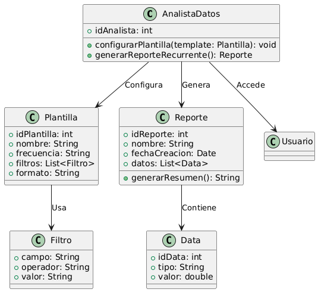

# GESTIÓN ANALISIS Y REPOSTES 

------

## Caso de uso historia 
María, analista de datos, identifica la necesidad de generar informes de ventas semanales. Accede al sistema y configura una plantilla seleccionando los datos, filtros y formato que desea incluir. El sistema guarda la plantilla y, cada semana, genera automáticamente el informe según la configuración establecida, ahorrando tiempo y esfuerzo en tareas repetitivas.

---

<table id="customers">
  <tr class="idtext principal">
    <td>ID SYN-50</td>
  </tr>
  <tr class="single text">
    <td><strong>Requerimiento</strong>:Configurar plantillas para reportes recurrentes. ID SYN-50</td>
  </tr>
  <tr class="single gray">
    <td><strong>Historia de usuario</strong></td>
  </tr>
  <tr class="single text">
    <td>Como analista de datos quiero configurar plantillas para reportes recurrentes para poder generar automáticamente informes periódicos sin tener que configurarlos manualmente cada vez.
</td>
  </tr>
  <tr class="duo">
    <th class="gray"><strong>Estado de la tarea</strong></th>
    <th>En desarrollo</th>
  </tr>
  <tr class="single gray">
    <td><strong>Caso de uso (Pasos)</strong></td>
  </tr>
  <tr class="single text">
    <td>
        <ol>
            <li>
             <li>El usuario inicia sesión en el sistema y accede a la sección de "Configuración de Reportes".</li>
            <li>El sistema muestra una opción para crear una nueva plantilla de reporte recurrente.</li>
            <li>El usuario selecciona los datos que quiere incluir en el reporte, como:Tipo de reporte (ventas, inventarios, transacciones, etc.), Período de tiempo (diario, semanal, mensual), Parámetros adicionales (por ejemplo, categorías de productos, tipos de clientes).</li>
            <li>El usuario define la frecuencia del reporte (por ejemplo, diario, semanal, mensual) y selecciona el formato de salida (PDF, Excel, CSV).</li>
            <li>El usuario guarda la plantilla con un nombre descriptivo.</li>
            <li>El sistema asocia la plantilla a un cronograma de generación automática de reportes.</li>
            <li>El sistema genera el reporte automáticamente conforme a la frecuencia definida y lo envía al usuario o a los destinatarios asignados.</li>
          </ol>
   </td>
  </tr>
  <tr class="single gray">
    <td><strong>Criterios de aceptación</strong></td>
  </tr>
  <tr class="single text">
    <td>
        <ol>
              <li>El sistema debe permitir la creación de plantillas de reportes recurrentes con datos específicos (ventas, inventarios, transacciones).</li>
              <li>El sistema debe permitir la configuración de la frecuencia de generación de reportes (diaria, semanal, mensual).</li>
              <li>El sistema debe permitir al usuario seleccionar el formato de salida (PDF, Excel, CSV).</li>
              <li>El sistema debe generar los reportes automáticamente según la frecuencia establecida.</li>
              <li>El sistema debe permitir editar o eliminar plantillas previamente creadas.</li>
              <li>Si ocurre un error en los datos o la configuración, el sistema debe mostrar un mensaje claro de error para que el usuario lo corrija.</li>
 <tr class="duo">
    <th class="gray"><strong>Calidad</strong></th>
    <th>En desarrollo</th>
  </tr>
  <tr class="duo">
    <th class="gray"><strong>Versionamiento</strong></th>
    <th>En desarrollo</th>
  </tr>
</table>

---
## Diagrama de Clases
[Creado con plantuml](https://plantuml.com/es/)

---