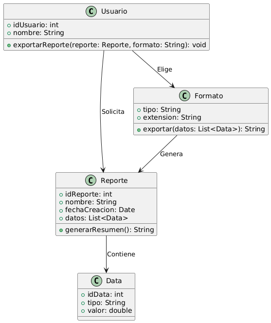

# GESTIÓN ANALISIS Y REPOSTES 

------

## Caso de uso historia 
Diego, usuario del sistema, necesita compartir un informe de ventas con su equipo. Accede a la opción de exportación y selecciona el formato PDF para una presentación clara y profesional. En otro momento, exporta el mismo informe en formato Excel para analizar los datos en detalle. Gracias a las opciones de formato, Diego adapta los reportes a sus necesidades fácilmente.

---

<table id="customers">
  <tr class="idtext principal">
    <td>ID SYN-51</td>
  </tr>
  <tr class="single text">
    <td><strong>Requerimiento</strong>:Exportar reportes en múltiples formatos. ID SYN-51</td>
  </tr>
  <tr class="single gray">
    <td><strong>Historia de usuario</strong></td>
  </tr>
  <tr class="single text">
    <td>Como usuario del sistema quiero exportar reportes en múltiples formatos para poder elegir el formato más adecuado según mis necesidades de análisis o distribución.
</td>
  </tr>
  <tr class="duo">
    <th class="gray"><strong>Estado de la tarea</strong></th>
    <th>En desarrollo</th>
  </tr>
  <tr class="single gray">
    <td><strong>Caso de uso (Pasos)</strong></td>
  </tr>
  <tr class="single text">
    <td>
        <ol>
            <li>
             <li>El usuario inicia sesión en el sistema y accede a la sección de "Reportes".</li>
            <li>El usuario selecciona el reporte que desea exportar de la lista de reportes generados.</li>
            <li>El sistema muestra una opción de "Exportar" junto con los formatos disponibles: PDF, Excel, CSV, y otros.</li>
            <li>El usuario selecciona el formato deseado (por ejemplo, PDF, Excel, etc.).</li>
            <li>El sistema genera el archivo en el formato elegido y permite al usuario descargarlo.</li>
            <li>El sistema muestra un mensaje de confirmación al usuario indicando que el archivo se ha exportado correctamente.</li>
          </ol>
   </td>
  </tr>
  <tr class="single gray">
    <td><strong>Criterios de aceptación</strong></td>
  </tr>
  <tr class="single text">
    <td>
        <ol>
              <li>El sistema debe permitir la exportación de reportes en al menos los siguientes formatos: PDF, Excel (XLSX), CSV.</li>
              <li>El sistema debe permitir al usuario seleccionar el formato de exportación antes de generar el archivo.</li>
              <li>El sistema debe generar el archivo correctamente y permitir al usuario descargarlo sin errores.</li>
              <li>El sistema debe mostrar un mensaje de confirmación cuando el archivo haya sido exportado con éxito.</li>
              <li>El sistema debe mostrar un mensaje de error en caso de que ocurra un problema durante el proceso de exportación, y ofrecer la opción de intentarlo nuevamente.</li>
 <tr class="duo">
    <th class="gray"><strong>Calidad</strong></th>
    <th>En desarrollo</th>
  </tr>
  <tr class="duo">
    <th class="gray"><strong>Versionamiento</strong></th>
    <th>En desarrollo</th>
  </tr>
</table>

---
## Diagrama de Clases
[Creado con plantuml](https://plantuml.com/es/)

---
 