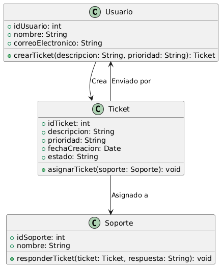

# GESTIÓN SOPORTE Y COMUNICACIÓN

------

## Caso de uso historia 
Laura, usuaria del sistema, enfrenta un problema técnico al generar un reporte. Accede al módulo de soporte y crea un ticket, proporcionando una descripción detallada del problema y marcándolo con prioridad "Alta" debido a su impacto en sus tareas. El sistema registra el ticket y lo envía al equipo de soporte, priorizándolo según la urgencia definida por Laura. Esto asegura que su solicitud sea atendida rápidamente

---

<table id="customers">
  <tr class="idtext principal">
    <td>ID SYN-53</td>
  </tr>
  <tr class="single text">
    <td><strong>Requerimiento</strong>:Crear tickets de soporte con descripción y prioridad. ID SYN-53</td>
  </tr>
  <tr class="single gray">
    <td><strong>Historia de usuario</strong></td>
  </tr>
  <tr class="single text">
    <td>Como usuario del sistema quiero crear tickets de soporte con una descripción y prioridad, para garantizar que mis solicitudes sean atendidas de manera eficiente según su urgencia.

</td>
  </tr>
  <tr class="duo">
    <th class="gray"><strong>Estado de la tarea</strong></th>
    <th>En desarrollo</th>
  </tr>
  <tr class="single gray">
    <td><strong>Caso de uso (Pasos)</strong></td>
  </tr>
  <tr class="single text">
    <td>
        <ol>
            <li>
             <li>El usuario accede al módulo de soporte en el sistema.</li>
            <li>Selecciona la opción para "Crear un nuevo ticket".</li>
            <li>Ingresa una descripción detallada del problema o solicitud.</li>
            <li>Define la prioridad del ticket (por ejemplo, alta, media o baja).</li>
            <li>Adjunta cualquier archivo relevante (opcional).</li>
            <li>Confirma la creación del ticket.</li>
            <li>El sistema guarda el ticket, genera un número único de identificación y lo asigna automáticamente al equipo de soporte correspondiente.</li>
            <li>El usuario recibe una notificación de confirmación con los detalles del ticket.</li>
          </ol>
   </td>
  </tr>
  <tr class="single gray">
    <td><strong>Criterios de aceptación</strong></td>
  </tr>
  <tr class="single text">
    <td>
        <ol>
              <li>Registro Completo: El sistema debe permitir registrar tickets con descripción y prioridad obligatoria.</li>
              <li>Identificación Única: Cada ticket debe tener un número único que lo identifique.</li>
              <li>Notificación al Usuario: El usuario debe recibir una notificación confirmando la creación del ticket y proporcionando los detalles básicos (número de ticket, descripción, prioridad).</li>
              <li>Adjuntar Archivos (Opcional): El sistema debe permitir adjuntar documentos o imágenes relevantes al ticket.</li>
              <li>Validación de Campos: El sistema debe alertar al usuario si no se completan los campos obligatorios antes de guardar el ticket.</li>
            </ol>
 <tr class="duo">
    <th class="gray"><strong>Calidad</strong></th>
    <th>En desarrollo</th>
  </tr>
  <tr class="duo">
    <th class="gray"><strong>Versionamiento</strong></th>
    <th>En desarrollo</th>
  </tr>
</table>

---
## Diagrama de Clases
[Creado con plantuml](https://plantuml.com/es/)

---
 